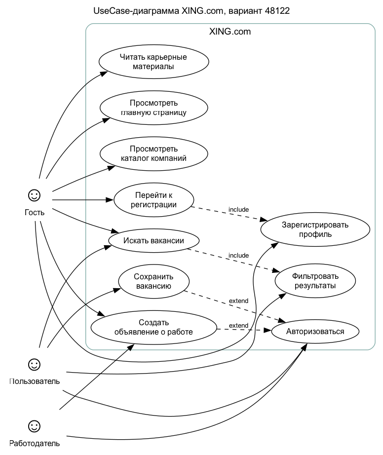

# Лабораторная работа №3

Вариант: №48122\
Сайт: XING.com --- <https://www.xing.com/>\
Выполнил: Заименко Владимир, Владимиров Владислав
2026г.

## 1. Текст задания

Сформировать варианты использования, разработать на их основе тестовое
покрытие и провести функциональное тестирование интерфейса сайта в
соответствии с вариантом.

Требования к выполнению:

1.  Тестовое покрытие должно быть сформировано на основании набора
    прецедентов использования сайта.
2.  Тестирование должно осуществляться автоматически с помощью Selenium.
3.  Шаблоны тестов должны формироваться при помощи Selenium IDE и
    исполняться в браузерах Firefox и Chrome.
4.  Так как сайт использует динамическую генерацию элементов, выбор
    элементов DOM должен выполняться не по `id`, а с помощью XPath.

## 2. Краткое описание тестируемого сайта

XING --- сайт для поиска работы, просмотра работодателей, чтения
карьерных материалов, регистрации профиля пользователя и создания вакансий
работодателем. Для тестирования выбраны публичные сценарии гостевого
пользователя, потому что они воспроизводимы без реального аккаунта и не
меняют данные на сайте.

Публичные разделы, вошедшие в покрытие:

- главная страница и навигация;
- поиск вакансий;
- каталог компаний;
- раздел Network с переходом к регистрации;
- регистрационная форма;
- раздел Insights с карьерными материалами;
- стартовая форма создания объявления о вакансии.

## 3. UseCase-диаграмма

Основные актеры:

- Гость --- пользователь без авторизации.
- Пользователь --- ищет вакансии и сохраняет
  интересные позиции.
- Работодатель --- размещает вакансии.

Основные прецеденты:

  ------------------------------------------------------------------
  ID              Прецедент          Актер           Описание
  --------------- ------------------ --------------- ---------------
  UC-01           Просмотреть        Гость           Открывает сайт,
                  главную страницу                   видит
                                                     назначение
                                                     сервиса и
                                                     основные
                                                     разделы

  UC-02           Искать вакансии    Гость,          Переходит в
                                     Пользователь    поиск вакансий
                                                     и просматривает
                                                     результаты

  UC-03           Фильтровать        Пользователь    Использует
                  результаты                         фильтры
                                                     вакансий по
                                                     локации,
                                                     формату работы,
                                                     занятости,
                                                     уровню и
                                                     зарплате

  UC-04           Сохранить вакансию Пользователь    Нажимает Save
                                                     job; для
                                                     полного
                                                     действия
                                                     требуется
                                                     авторизация

  UC-05           Просмотреть        Гость           Изучает
                  каталог компаний                   компании и
                                                     доступные
                                                     вакансии
                                                     работодателей

  UC-06           Перейти к          Гость           Из раздела
                  регистрации                        Network
                                                     переходит к
                                                     созданию
                                                     профиля

  UC-07           Зарегистрировать   Гость           Заполняет форму
                  профиль                            регистрации

  UC-08           Читать карьерные   Гость           Просматривает
                  материалы                          статьи и
                                                     рекомендации в
                                                     Insights

  UC-09           Создать объявление Работодатель    Открывает форму
                  о работе                           создания
                                                     вакансии

  UC-10           Авторизоваться     Пользователь,   Входит в
                                     работодатель    аккаунт для
                                                     персональных
                                                     функций
  ------------------------------------------------------------------

## 4. CheckList тестового покрытия

  ---------------------------------------------------------------------------------------------------
  ID              Проверка           Приоритет       Автотест
  --------------- ------------------ --------------- ------------------------------------------------
  CL-01           Главная страница   High            `homePageShowsAiJobSearchHero`
                  содержит hero                      
                  AI-поиска                          

  CL-02           В навигации        High            `homeNavigationContainsFindJobs`
                  доступен Find jobs                 

  CL-03           В навигации        High            `homeNavigationContainsCompanies`
                  доступен Companies                 

  CL-04           В навигации        Medium          `homeNavigationContainsNetwork`
                  доступен Network                   

  CL-05           В навигации        Medium          `homeNavigationContainsInsights`
                  доступен Insights                  

  CL-06           В навигации        High            `homeNavigationContainsSearch`
                  доступен Search                    

  CL-07           В навигации        High            `homeNavigationContainsLogin`
                  доступен Log in                    

  CL-08           Главная содержит   High            `homeShowsPreferenceControls`
                  controls                           
                  предпочтений                       
                  вакансий                           

  CL-09           AI search entry    High            `homeAiSearchEntryLinksToJobsSearch`
                  ведет на поиск                     
                  вакансий                           

  CL-10           Главная содержит   Medium          `homeShowsPopularEmployersBlock`
                  блок популярных                    
                  работодателей                      

  CL-11           Поиск вакансий     High            `jobsSearchPageShowsAllAvailableJobsHeading`
                  содержит All                       
                  available jobs                     

  CL-12           Поиск вакансий     High            `jobsSearchPageHasLocationInput`
                  содержит поле                      
                  Location                           

  CL-13           Поиск вакансий     High            `jobsSearchPageShowsWorkplaceFilter`
                  содержит фильтр                    
                  Workplace                          

  CL-14           Поиск вакансий     High            `jobsSearchPageShowsEmploymentTypeFilter`
                  содержит фильтр                    
                  Employment type                    

  CL-15           Поиск вакансий     High            `jobsSearchPageShowsCareerLevelFilter`
                  содержит фильтр                    
                  Career level                       

  CL-16           Поиск вакансий     High            `jobsSearchPageShowsSalaryFilter`
                  содержит фильтр                    
                  Salary                             

  CL-17           В выдаче есть      High            `jobsSearchPageListsMultipleJobCards`
                  минимум 5 карточек                 
                  вакансий                           

  CL-18           В выдаче есть      High            `jobsSearchPageShowsSaveJobActions`
                  минимум 5 действий                 
                  Save job                           

  CL-19           Каталог содержит   High            `companiesPageShowsTopCompaniesSection`
                  Top companies                      
                  hiring now                         

  CL-20           Каталог содержит   Medium          `companiesPageShowsCompaniesByIndustrySection`
                  Companies by                       
                  industry                           

  CL-21           Каталог содержит   Medium          `companiesPageListsCompanyHeadings`
                  минимум 8                          
                  заголовков                         
                  компаний                           

  CL-22           Каталог содержит   Medium          `companiesPageListsCompanyJobLinks`
                  минимум 5 ссылок                   
                  View ... jobs                      

  CL-23           Ссылка View ...    Medium          `firstCompanyJobLinkPointsToCompanyJobs`
                  jobs ведет в                       
                  раздел вакансий                    

  CL-24           Network показывает High            `networkPageShowsJoinPrompt`
                  Join XING now                      

  CL-25           Register now ведет High            `networkRegisterLinkPointsToLoginXing`
                  на                                 
                  `login.xing.com`                   

  CL-26           Network содержит   Medium          `networkPageShowsLoginLink`
                  Log in                             

  CL-27           Регистрация        High            `signupPageShowsHeading`
                  содержит основной                  
                  заголовок                          

  CL-28           Регистрация        Medium          `signupShowsGoogleAndAppleOptions`
                  содержит Google и                  
                  Apple options                      

  CL-29           Регистрация        High            `signupHasFirstAndLastNameFields`
                  содержит First                     
                  name и Last name                   

  CL-30           Регистрация        High            `signupHasEmailAndPasswordFields`
                  содержит E-mail и                  
                  Password                           

  CL-31           Пустой First name  High            `signupEmptyFormMarksFirstNameInvalid`
                  блокируется                        
                  валидацией                         

  CL-32           Пустой E-mail      High            `signupEmptyFormMarksEmailInvalid`
                  блокируется                        
                  валидацией                         

  CL-33           Регистрация        Medium          `signupTermsAndPrivacyLinksPresent`
                  содержит GTC и                     
                  Privacy Policy                     

  CL-34           Insights содержит  Medium          `insightsShowsRecommendedCategory`
                  Recommended                        

  CL-35           Insights содержит  Medium          `insightsShowsSalaryCategory`
                  Salary                             

  CL-36           Insights содержит  Medium          `insightsShowsJobSearchCategory`
                  Job search                         

  CL-37           Insights содержит  Medium          `insightsListsArticleLinks`
                  минимум 5 ссылок                   
                  материалов                         

  CL-38           Форма работодателя High            `jobAdCreationPageShowsHeading`
                  содержит XING Job                  
                  Ads                                

  CL-39           Форма работодателя High            `jobAdCreationPageHasJobTitleAndCompanyInputs`
                  содержит Job Title                 
                  и Company                          

  CL-40           Форма работодателя High            `jobAdCreationPageHasPreviewButton`
                  содержит Preview                   
                  your ad                            
  ---------------------------------------------------------------------------------------------------

## 5. Описание набора тестовых сценариев

Подробная таблица TC-01...TC-40 вынесена в `docs/test_scenarios.md`. В
отчет включена структура набора:

  --------------------------------------------------------------
  Группа               Сценарии             Назначение
  -------------------- -------------------- --------------------
  Главная страница     TC-01...TC-10        Проверка hero,
                                            навигации,
                                            preference controls,
                                            AI search entry и
                                            блока работодателей

  Поиск вакансий       TC-11...TC-18        Проверка страницы
                                            поиска, поля
                                            Location, фильтров,
                                            карточек вакансий и
                                            Save job

  Каталог компаний     TC-19...TC-23        Проверка разделов
                                            каталога, карточек
                                            компаний и ссылок на
                                            вакансии

  Network              TC-24...TC-26        Проверка приглашения
                                            к регистрации и
                                            переходов Register
                                            now / Log in

  Регистрация          TC-27...TC-33        Проверка формы,
                                            OAuth-вариантов,
                                            обязательных полей и
                                            HTML5-валидации

  Insights             TC-34...TC-37        Проверка категорий
                                            материалов и списка
                                            статей

  Работодатель         TC-38...TC-40        Проверка стартовой
                                            формы создания
                                            объявления о
                                            вакансии
  --------------------------------------------------------------

## 6. Реализация автоматизации

Шаблон Selenium IDE подготовлен в файле
`selenium-ide/xing_variant_48122.side`. 

Исполняемый набор из 40 автотестов находится в
`src/test/java/ru/tpo/lr3/XingPublicTest.java`. Тесты написаны на Java +
JUnit 5 + Selenium WebDriver.

Примечание по XPath: в тестовом коде не используется `By.id`; даже
элементы с динамическими `id` выбираются по тексту, атрибутам формы и
XPath-условиям.

## 7. Результаты тестирования

Фактический прогон выполнен 21.05.2026 в Chrome, установленном локально.
Firefox в текущем окружении отсутствует, поэтому Firefox-прогон
завершился корректными `skip`, а не падением тестов.

  -----------------------------------------------------------------------------
  Браузер              Результат            Комментарий
  -------------------- -------------------- -----------------------------------
  Chrome               40 passed за 7 min   HTML-отчет Gradle:
  146.0.7680.178       12 s                 `test-results/chrome/index.html`

  Firefox              40 skipped           Браузер не установлен; HTML-отчет
                                            Gradle:
                                            `test-results/firefox/index.html`
  -----------------------------------------------------------------------------

Итог по доступному окружению: все 40 автоматизированных функциональных
сценариев успешно прошли в Chrome. Набор тестов параметризован и готов к
запуску в Firefox после установки браузера.

## 8. Выводы

На основании use-case XING.com сформировано тестовое покрытие из 40
публичных пользовательских сценариев. Покрытие проверяет навигацию,
поиск вакансий, каталог компаний, переходы к регистрации, обязательность
полей регистрационной формы, карьерные материалы и стартовую форму
работодателя.

Автоматизация выполнена Selenium-тестами с XPath-локаторами.
